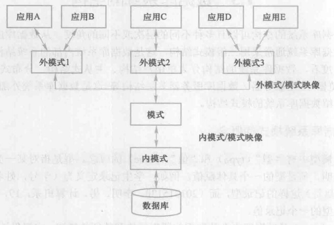

# 数据库概述

---

##数据库基本概念

**数据**：描述事物的符号记录称为数据，<u>数据与其语义是不可分的</u>

**数据库**：数据库是<u>长期</u>存储在计算机内、<u>有组织的</u>、<u>可共享的</u>大量数据的集合。数据库里的数据具有<u>较小的冗余度、较高的数据独立性和易扩展性，并可为各种用户共享</u>。

**数据库管理系统**：是位于用户和操作系统之间的一层数据管理系统。SQL语言包括<u>数据查询、数据定义、数据操纵、数据控制</u>功能。

**数据库系统**：是由数据库、数据库管理系统、应用程序和数据管理员（DBA）组成的存储、管理、处理和维护数据的系统。

## 数据库特点

**数据结构化**：数据库系统实现了整体数据的结构化，这是数据库系统与文件系统的本质区别。

**数据共享度高、冗余度低且易扩充**：数据共享可以大大减少数据冗余，节约存储空间，数据共享还可以避免数据间的不相容性和不一致性。

**数据独立性高**：包括数据的物理独立性和逻辑独立性。物理独立性是指用户的应用程序和数据库的数据的物理存储是相互独立的。逻辑独立性是指用户的应用程序与数据库的逻辑结构是独立的。

**数据由数据库管理系统统一管理和控制**：为了保障数据的正确性和一致性，数据库管理系统必须提供数据的安全性保护、数据的完整性保护、并发控制、数据库恢复。

# 数据模型

---

==数据库的数据模型包括概念模型（对数据进行建模，用于数据库设计）、逻辑模型（用于数据库的实现）和物理模型（对数据底层的抽象）。==

## 概念模型

### 基本概念

**实体**：客观存在并可以相互实现的事物称为实体。

**属性**：事物所具有的某种特征称为实体。

**码**：唯一标识实体的属性集称为码。

**实体型**：用实体名及其属性名集合抽象地刻画同类型实体，称为实体性。

**实体集**：同一类型实体的集合。

**联系**：不同实体集间的联系。实体间有<u>一对一、一对多、多对多</u>等多种类型。

## 组成要素

**数据结构**：数据结构描述数据库中组成组成对象和对象之间的联系。

**数据操作**：数据操作是指对数据库中的各种对象和值的操作的集合，包括操作规则。

**数据的完整性约束条件**：指一组完整性规则。完整性规则是指是指定数据库中的数据模型中数据及其联系所具有的制约和依存规则，限制符合数据模型的数据库状态以及状态的变化。

## 逻辑模型

常见的有==层次模型==、==网状模型==、==关系模型==、==面向对象模型==。

# 数据库结构

---

**型与值与模式**：

数据库中的型是对某一类数据的结构和属性的说明，值是一个具体的赋值。

模式是数据库中全体数据的逻辑结构和特征的描述。仅仅涉及型的描述，模式的一个具体的值为模式的一个实例。

## 数据库系统的三级模式结构

三级结构是指数据库系统是由外模式、模式和内模式三级构成。

**外模式**：子模式或用户模式，是数据库用户的数据视图。

**内模式**：存储模式。一个数据库只有一个内模式，是数据库物理结构和存储方式的描述，是数据的组织方式。

## 二级映像功能和数据独立性

**外模式/模式映像**：

当模式改变时，由数据库管理员对外模式/模式映像映像进行改变，保持外模式不变。

保证了数据与程序的逻辑独立性，即数据的逻辑独立性。

**模式/内模式映像**：

当数据的存储结构改变时，由数据库管理员对模式/内模式映像映像进行改变，保持模式不变。

保证了数据与程序的逻辑独立性，即数据的逻辑独立性。

#关系数据库

---

## 关系概念

**域**：具有相同数据类型的值的集合。

**笛卡尔积**：是域上的一种集合运算。

给定一组域的集合D~1~、D~2~…D~n~（允许域中的某些值相同）的笛卡尔积为

D~1~XD~2~X…XD~n~={（d~1~,d~2~,…,d~n~）|d~i~属于D~i~,i=1,2,…,n}

每一个元素（d~1~,d~2~,…,d~n~）叫一个**n元组**，简称**元组**，其中每一个值d~i~叫一个**分量**。

一个域允许的不同取值个数称为这个域的**基数**。

笛卡尔积可以表示一个二维表，表中的每一行对应元组，表中的每一列的值来自一个域。

例：D~1~=姓名={张三、李四}，D~2~=专业={计算机、电子信息}，D~1~XD~2~=

| 姓名 | 专业     |
| ---- | -------- |
| 张三 | 计算机   |
| 张三 | 电子信息 |
| 李四 | 计算机   |
| 李四 | 电子信息 |

**关系**：笛卡尔积的子集叫做关系，表示为R(D~1~,D~2~,…,D~n~)。n称为关系的**目**或**度**。n=1称为**一元关系**，n=2称为**二元关系**。关系具有三种类型：**基本关系、查询表、视图表**。

**候选码**：某一属性组的值唯一地标识一个元组，而其子集不能。若一个关系有多个候选码，则选定一个称为**主码**。候选码的诸属性称为**主属性**。

**基本关系的五个性质**

* 每一列的分量来自同一数据类型

* 不同列可以来自同一个域，每一列为一个属性

* 行列的顺序无所谓

* 任意两个元组的候选码不能取相同的值

* 分量必须取原子值，即每一个分量必须是不可分割的数据项（表中不能有表）

## 关系的完整性

**实体完整性**:若属性（组）A是基本关系R的主属性，则A不能是空值，即无意义的值。

**参照完整性**：<u>若属性（组）F是基本关系R的外码，它与基本关系S的主码K相对应，则对于R中每一个元组在F上的值必须：均为空值　或者　等于S中某个元组的值</u>

关系之间往往存在参照关系，表示关系之间的相互引用、相互约束的情况。

定义：设F是基本关系R的一个或一组属性**但不是关系R的码**，K是基本关系S的主码。如果F与K相对应，则称F是R的外码，称基本关系R为参照关系，基本关系S为被参照关系（或目标关系）。R与S可以是同一关系。表示为：R—<u>^F－K^</u>—>S。R为从表，S为主表=

例：学生（<u>学号</u>，姓名，性别，专业号，年龄），专业（<u>专业号</u>，专业号）学生关系的专业号引用了专业关系的主码专业号。专业关系为被参照关系，学生关系为参照关系。专业号是学生关系的外码。表示为：学生关系—<u>^专业号^</u>—>专业关系。

**用户定义的完整性**：在具体的关系数据库的约束条件中，某一具体应用所涉及的数据必须满足语义要求。

## 关系代数

### 传统集合运算

**并(U)、差(-)、交、笛卡尔积(x)**

### 专门的关系运算

*专门的关系运算包括选择、投影、连接、除*

*关系模式为R(A~1~,A~2~,A~3~,…,A~n~)，t是R的一个元组 t[A~i~]表示元组t中相应于属性A~i~的一个分量*

*A={A~i1~,A~i2~,A~i3~,…,A~in~}其中A~i1~,A~i2~,A~i3~,…,A~in~是A~1~,A~2~,A~3~,…,A~n~中的一部分，则称A为属性组或属性列，t[A]=(t[A~i1~],t[A~i2~],…,t[A~in~])是元组t在属性列上的A的诸多分量的合集。*

*象集：关系R(X,Z)，X和Z为属性组，t[X]=x时，x 在R中的象集为X=x诸多元组在Z上的分量的合集*

**选择**：选择符合条件的行。

**投影**：选择符合条件的列，组成新的关系。

**连接**：从两个关系的笛卡尔积中选取属性间满足一定条件的元组，若这个条件为<u>相等</u>则称为**等值连接**。**自然连接**：把等值连接中重复的属性列去掉，自然连接是一种特殊的等值连接。

**除**：基本定义为：

设关系R除以关系S的结果为关系T ，**则T包含所有在R但是不在S中的属性和值，且T的元组与S的元组的所有组合都在R中**。

运用象集定义：
给定关系R(X,Y)和S(Y,Z)，其中X，Y，Z为属性组。R中的Y与S中的Y可以有不同的属性名，但必须出自相同的域集，R与S的除运算的结果为关系P(X)是元组X上分量x的象集Y~x~包含S在Y上投影的集合。

***实例***

关系R：

| A    | B    | C    |
| ---- | ---- | ---- |
| a~1~ | b~1~ | c~2~ |
| a~2~ | b~3~ | c~7~ |
| a~1~ | b~2~ | c~3~ |
| a~2~ | b~4~ | c~5~ |
| a~1~ | b~2~ | c~1~ |

关系S

| B    | C    | D    |
| ---- | ---- | ---- |
| b~1~ | c~2~ | d~1~ |
| b~2~ | c~3~ | d~3~ |
| b~2~ | c~1~ | d~5~ |

关系R除以关系S：

| A    |
| ---- |
| a~1~ |

