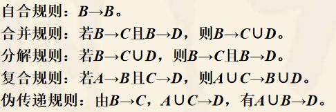
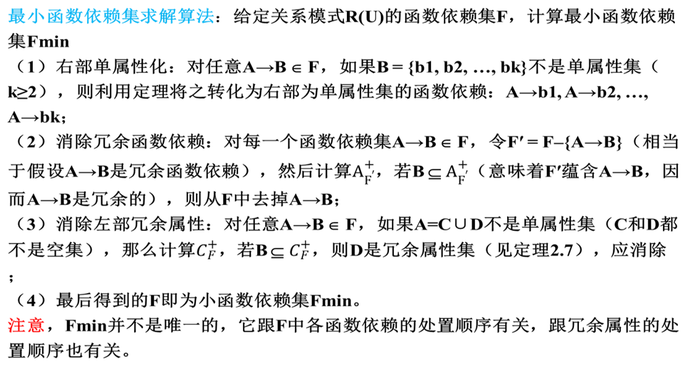

# 关系数据理论

---

## 函数依赖与码

### 函数依赖

**函数依赖：**设R(U)是属性集U上的一个关系模式，A, B属于U，对于R(U)的任意一个可能的关系r，若关系r的两个元组x1, x2满足x1(A) = x2(A)，则必有x1(B) = x2(B)，那么A函数决定B，或称B函数依赖于A，记为A→B，A中的每个属性都称为决定因素。

**（非）平凡函数依赖：**设R(U)是属性集U上的一个关系模式，A,B属于U。若A→B是一个函数依赖，如果==B属于A==，则称A→B为一个平凡函数依赖；如果==B不属于==A，则称A→B为一个非平凡函数依赖。一般仅讨论==非平凡函数依赖==。

**完全函数依赖与部分函数依赖：**设R(U)是属性集U上的一个关系模式，A, B属于U。若A→B是一个函数依赖，并且对于任意C属于A且C非空，均有C不决定B，则称A→B是一个==完全函数依赖==，即B完全函数依赖于A，记为A—<u>^f^</u>—>B ；否则称A→B是一个==部分函数依赖==，即B部分函数依赖于A，记为A—<u>^p^</u>—>B 。

**传递函数依赖：**设R(U)是属性集U上的一个关系模式，A, B, C属于U。若A→B(B不属于A, B不决定A)，且B→C(C不属于B)成立，则称C传递函数依赖于A，记为A—<u>^t^</u>—>C。

**函数依赖关系：**

| 函数依赖       | 含义                                                 |
| -------------- | ---------------------------------------------------- |
| 一对一（1：1） | 这时X和Y之间存在函数依赖：X → Y且Y → X，即X→Y且Y→X。 |
| 多对一（m:1）  | 这时只存在函数依赖：X→Y                              |
| 多对多（m:n）  | 这时X和Y之间不存在任何函数依赖关系。                 |

**函数依赖的性质：**

### 码

**候选码和主码：**在关系模式R(U)中，假设A属于U，如果A—<u>^f^</u>—>U，则A称为关系模式R(U)的一个==候选码==；候选码可能有多个，从候选码中选择一个用于唯一标识关系中的每一个元组，则该候选码称为==主码==。通常将主码和候选码都简称为==码==，包含在任何候选码中的属性称为==主属性==。

**超码：**设K是R<U ,F>中的属性（组），若K→U，则K是R的超码。

**外码：**若关系模式R中的属性（组）X不算R的码，是另一个关系模式的码，则X是R的外码。

**全码：**一个关系模式的所有属性构成码，称为全码。

---

## 关系模式的范式

**1NF：**满足最低要求（无表中套表）的关系模式，称为第一范式。1NF的问题：插入异常、删除异常、修改复杂。

**2NF：**若R属于1NF，且每一个==非主属性==完全函数依赖于任何一个候选码，则R属于第二范式。==即消除了部分函数依赖==

**2NF的规范化算法：**给定属于1NF的关系模式R(U)，将之无损分解为若干属于2NF的关系模式
（1）p为空集；
（2）在关系模式R(U)中，找出部分函数依赖，假设为W→B，其中W为一候选码，B 
           为非主属性集B；
（3）找出W的一个真子集A，使得A→B；
（4）将R(U)分解为==R1(A∪B)和R2(U-B)==，并令p =p∪{R1(A∪B)}；
（5）如果R2(U-B)属于2NF，令p=p∪{R2(U-B)}，转（6），否则令R(U) = R2(U-B)，
           转（2）；
（6）返回p，算法结束。结果，p包含了若干个属于2NF的关系模式。

**3NF：**若R属于1NF，R中每一个==非主属性==既不传递依赖于码，也不部分依赖于码，则R为３NF，如果一个关系模式的属性全是主属性，那该关系模式肯定属于第三范式，因为该关系模式不存在非主属性。。==即消除了传递函数依赖==

**3NF的规范化算法：**给定R(U)及其函数依赖集F，将之分解成若干属于3NF的关系模式，并保持函数依赖。
（1）计算F的最小函数依赖集Fmin；
（2）找出U中所有不在Fmin中出现的属性，令U0表示这些属性的集合，F0表示   
           对应的函数依赖集，并令U = U – U0；
（3）如果存在A→B属于Fmin，使得A∪B = U，则令p= {R0(U0), R(U)}，转（6）；
（4）按“决定因素聚类”原则，对Fmin中的函数依赖进行极大化处理，即若Fmin
           中包含A→B1, A→B2, …, A→Bk，则将它们复合成A→B∪B2∪…∪Bk；
（5）将每个极大化后的函数依赖A→B∪B2∪…∪Bk转化为对应的关系模式
            R(A∪B∪B2∪…∪Bk)，并令p表示所有这样关系模式的集合，假设
           p= {R0(U0), R1(U1), …, Rt(Ut)}（若Ui属于Uj，则去掉Ui，i ≠ j）； 
（6）返回p，停止分解。

>student_supervisor(SNo, SName, SDept, TNo, TName, TTitle)
>SNo→SName, SNo→SDept, SNo→TNo, TNo→TName, TNo→Ttitl
>
>下面按照3NF规范化算法1对其进行分解：
>（1）经计算，F的最小函数依赖集Fmin = F（没有变化）；
>（2）U中所有属性均在Fmin中出现，故U0 =空集；
>（3）按“决定因素聚类”原则（Fmin中有两个不同的决定因素：SNo和TNo），
>           对Fmin中的函数依赖进行极大化处理，结果Fmin = {SNo→{SName, SDept, 
>            TNo}, TNo→{TName,TTitle}}；
>（4）将每个极大化后的函数依赖转化为对应的关系模式，并令表示这些关系模式
>            的集合，即p= {student(SNo, SName, SDept, TNo), supervisor(TNo, TName, 
>            TTitle)}；
>           也就是说，利用3NF规范化算法，student_supervisor被分解为两个关系模式：
>      

```
  student(SNo, SName, SDept, TNo)
  supervisor(TNo, TName, TTitle)
```

**BCNF：**若R属于1NF，有X→Y且Y不属于X时，X必包含码，则R属于BCNF，若第三范式只有一个候选码，则该第三范式为BCNF。==即消除了所有属性（主属性和非主属性）的部分依赖和传递依赖==

**BC范式规范化算法：**给定关系模式R(U)，将之无损分解为若干属于BC范式的关系模式
   (1)  p = {R(U)}，并令fg = 0;  
   (2)  For each R′(U′) in p do
         {
   (3)  p2 = 空集;
   (4)  如果在R′(U′)中存在左部不包含候选码的函数依赖A→B，其中A不包含候选码，B不属于A，那么将R′(U′)分解为R′1(A∪B)和R′2(U′-B)，并令p2 = p2∪{ R′1(A∪B), R′2(U′-B)}，同时令fg = 1，否则不需要分解R′(U′)，令p2 = p2∪{R′(U′)};
          } 
   (5)  令p = p2;
   (6)  如果fg=1，则转（2），否则转（7）;  // fg=0表示在最近循环中没有任何关系模式被分，故不需要重复以上分解步骤
   (7)  返回p，算法结束。

---

## 关系模式的规范化

### 闭包求解

闭包求解算法：给定F和子集B，计算闭包B^+^
（1）令L = B；
（2）遍历F中各个函数依赖，如果存在未用的函数依赖A→C属于F，使得A属于L，则                  
           令L = L∪C并将该函数依赖标记为已用，否则转（4）；
（3）重复步骤（2）；
（4）返回L（L即为所求的闭包B^+^）。
注意：上述任一步骤中，只要L = U即可退出该算法。

> **假设关系模式R(U)的函数依赖集F = {a→b, b→c, h→b}，请计算闭集a^+^及{b,h}^+^，其中U ={a, b, c, h}。**
>  解：先计算a+，过程如下：
>（1）L = {a}；
>（2）遍历F，发现a→b的左部为当前L的子集，故令L = L∪{b}= {a, b}；
>（3）遍历F，发现b→c的左部为当前L的子集，故令L = L∪{c}= {a, b, c}；
>（4）遍历F，未发现未用的函数依赖满足条件，输出L。
>  结果，a+ = {a, b, c}。
>  然后再计算{b,h}+，过程如下：
>（1）L = {b,h}+； 
>（2）遍历F，发现b→c的左部为当前L的子集，故令L = L∪{c}= {b,c,h}；
>（3）遍历F，发现h→b的左部为当前L的子集，故令L = L∪{b}= {b,c,h}；
>（4）遍历F，未发现未用的函数依赖满足条件，输出L。
>  结果，{b,h}+ = {b,c,h}。

### 求所有候选码

**将R的属性分为４类：**

1. L类：仅出现在F中函数依赖左部的属性，<u>包含在R(U)的每一候选码中</u>；
2. R类：仅出现在F中函数依赖右部的属性,<u>不包含在R(U)的任一候选码中</u>； 
3. N类：在F中函数依赖左右两边均未出现的属性，<u>包含在R(U)的每一候选码中</u>；
4. LR类：在F中函数依赖左右两边均出现的属性，<u>可能包含候选码中，也可能没有</u>。

**候选码求解算法：**

给定关系模式R(U)以及函数依赖集F，求R(U)的所有候选码
（1）Ckeys =空集；	//用于存放候选码
（2）利用F，求出L类、R类、N类、LR类属性，然后将这四类属性集分别记为L、R、N、LR           
          ，并令LN = L∪N；
（3）计算LN+，如果LN+=U，则转（10），否则转（4）；
（4）For i to n do   	// n = |LR|  
           {
（5）产生LR的m个i元子集：LR(i,1), LR(i,2), …, LR(i,m)，其中m = C(i, n)；
（6） For j to m do
           {   //注：将LN跟每一个i元子集进行并集，然后有选择地计算它们的闭包
（7）         如果LN∪LR(i,j)不包含Ckeys中任何元素（已产生的候选码），则：
（8）               计算(LN∪LR(i,j))+；
（9）        如果(LN∪LR(i,j))+=U，则令Ckeys = Ckeys∪{LN∪LR(i,j)}；//LN∪LR(i,j)为候选码
           }
        }
（10）输出Ckeys，结束计算过程. 
计算结束后，Ckeys包含的即为所有求的对应关系模式的所有候选码。

> **对于关系模式R(U)，假设U={a, b, c, d, e}，函数依赖集F = {{a,b}→c, b→d, c→e, {c,e}→b, {a,c}→b}，请求该关系模式的所有候选码。**
>
> 解：按上述候选码求解算法，求R(U)所有候选码的步骤如下：
> （1）Ckeys =空集；
> （2）求出L类、R类、N类、LR类属性，结果L = {a}, R = {d}, N =空集, LR = {b, c, e}，由此LN =           
>            L∪N = {a}；
> （3）LN+ = {a} ≠ U，故LN = {a}还不是候选码，需要继续后面的计算；
> （4）产生LR = {b, c, e}的1元子集：{b},{c},{e}，一共有3个；
> （5）将LN跟每个1元子集合并，结果得到3个属性集：{a,b},{a,c},{a,e}；
> （6）求各个并集的闭包，结果：{a,b}+ = {a,b,c,d,e} = U, {a,c}+ = {a,b,c,d,e}=U, {a,e}+ = {a,e}≠U
>           ，这表明{a,b}和{a,c}是候选码，添加到集合Ckeys中，这时Ckeys = {{a,b}, {a,c}}；
> （7）产生LR = {b, c, e}的2元子集：{b, c}, {b, e}, {c, e}，一共有3个；
> （8）将LN跟每个2元子集合并，结果得到3个属性集：{a, b, c}, {a, b, e}, {a, c, e}；
> （9）这时，由于这3个属性集都包含Ckeys中至少一个元素（候选码），所以都不需要计算它们
>            的闭包； 
> （10）产生LR = {b, c, e}的3元子集：{b, c, e}，一共有1个；
> （11）将LN跟该3元子集合并后得到：{a, b, c, e}，同样，由于{a, b, c, e}包含Ckeys中至少一个
>              元素，所以不需要计算它的闭包；
> （12）计算过程结束。
>   结果，Ckeys输出的内容为{a,b}, {a,c}。这表明{a,b}和{a,c}是关系模式R(U)所有的候选码。

### 求最小函数依赖

**定理：**

1. 对于关系模式R(U)的两个函数依赖集F和G，如果G^+^= F^+^，则称F和G是==等价==的。
2. 对于关系模式R(U)的两个函数依赖集F和G，F和G等价的充要条件是G属于F+且F属于G+
3. 假设F是关系模式R(U)的一个函数依赖集，Fmin称为F的一个==最小函数依赖集==，如果Fmin满足下列3个条件：
   （1）Fmin+ = F^+^；
   （2）对任意A→B属于Fmin，其左部A不包含冗余的属性（如果存在A′属于A，使得Fmin –{A→B}∪{A′→B}等价于Fmin，则A包含冗余属性集A–A′），其右部B都是单属性集；
   （3）Fmin不包含冗余的函数依赖（如果Fmin –{A→B}等价于Fmin，则A→B是冗余的）。



>**设有关系模式R(U)，U ={a, b, c, d, e, g}，函数依赖集F＝{c→a, {a, c, d}→b, d→{e, g}, {c, g}→b}。请求出F的最小函数依赖集。** 
解：根据求解Fmin算法，求解步骤如下：
（1）根据定理2.1，将F中每一个函数依赖的右边都转化成为单属性集，结果是：F＝{c→a, {a, c, 
           d}→b, d→e, d→g , {c, g}→b}；
（2）假设c→a是冗余的，令F′ = F–{c→a}＝{{a, c, d}→b, d→e, d→g , {c, g}→b}，在F′中c+ = c，但c+
           不包含a，故c→a不是冗余的，不能被删除，这时F不变；
（3）假设{a, c, d}→b是冗余的，令F′ = F–{{a, c, d}→b}＝{c→a, d→e, d→g , {c, g}→b}，在F′中{a, c, 
           d}+ = {a, b, c, d, e, g}，{a, c, d}+包含了b，故{a, c, d}→b是冗余的，应删除，这时F＝{c→a, d→e, 
           d→g , {c, g}→b}；
（4）假设d→e是冗余的，令F′ = F–{d→e}＝{c→a, d→g , {c, g}→b}，在F′中d+ = {d, g}，不包含e，故
           不能删除d→e，这时F不变；
（5）假设d→g是冗余的，令F′ = F–{d→g}＝{c→a, d→e, {c, g}→b}，在F′中d+ = {d, e}，不包含g，故
           不能删除d→g，这时F不变；
（6）假设{c, g}→b是冗余的，令F′ = F–{{c, g}→b}＝{c→a, d→e, d→g}，在F′中{c, g}+ = {a, c, g}，不包
           含b，故不能删除{c, g}→b，这时F不变；
（7）在F中g+ = g，不包含b，故c不是冗余属性；
（8）在F中c+ = {c, a}，不包含b，故g不是冗余属性；
（9）结果F＝{c→a, d→e, d→g , {c, g}→b}，即最小函数依赖集Fmin＝{c→a, d→e, d→g , {c, g}→b}。
    上述过程中，步骤（2）–（6）属于求解Fmin算法中的步骤（2），步骤（7）和（8）则属于算法中的步骤（3）。

