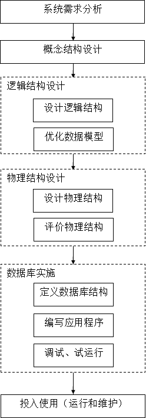
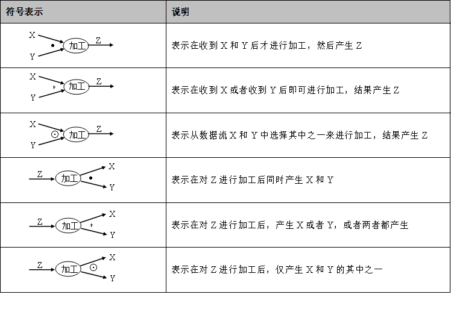
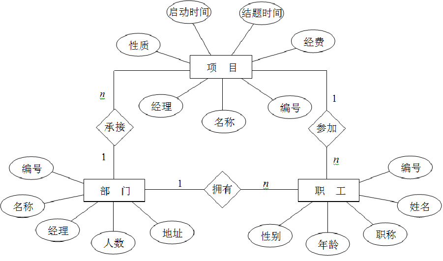
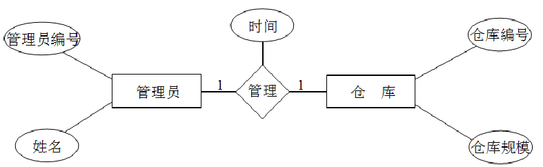
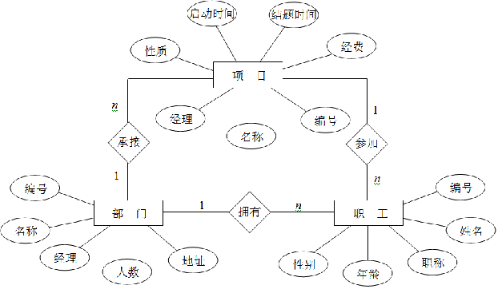
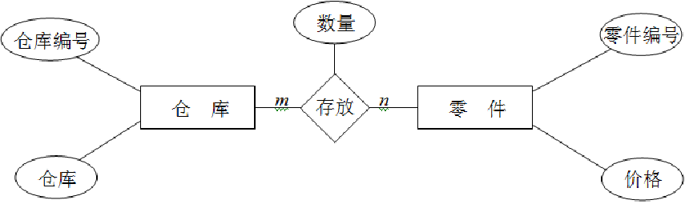

# 数据库的设计

---

## 数据库设计概述

---

**数据库设计：**是指在现有的应用环境下，从建立问题的概念模型开始，逐步建立和优化问题的逻辑模型，最后建立其高效的物理模型，并据此建立数据库及其应用系统，使之能够有效地收集、存储和管理数据，满足用户的各种应用需求。==一般分为六个阶段==

**需求分析阶段：**是==了解用户需求、然后明确用户需求==、最后形成需求文字表达（需求分析说明书）的一个过程。需求分析的最终结果就是形成一份有效的需求分析说明书。

**概念结构设计阶段：**概念结构设计的目的就是==对用户需求进行综合、归纳和抽象形成一个独立于数据库管理系统的概念模型==，即概念结构是用户需求在信息世界中的模型。

**逻辑结构设计阶段：**数据库的逻辑结构设计就是==将以E-R图表示的概念结构转换为DBMS支持的数据模型并对其进行优化==的过程。

**物理结构设计阶段：**物理结构设计就是==为既定的数据模型选取特定的、有效的存储结构和存储路径==的过程。

**数据库实施阶段：**==设计人员用数据库管理系统提供的数据库语言及其宿主语言，根据逻辑结构设计和物理结构设计的结果建立数据库，编写与调试应用程序，组织数据入库，并进行试运行。==

**数据库运行和维护阶段：**==数据库就可以正式投入使用，在数据库系统运行过程中必须不断地对其进行评估、调整和评价。==数据库的运行和维护并不是数据库设计的终点，而是数据库设计的延续和提高。数据库的日常运行和维护一般是由系统管理员（DBA）完成。

| 设计阶段           | 设计描述                                                     |
| ------------------ | ------------------------------------------------------------ |
| 需求分析阶段       | 使用==SA方法==和==数据流图==分析需求，产出==系统需求分析说明书==和==数据词典== |
| 概念结构设计阶段   | 根据需求分析结果，产出==概念模型（E-R图）==                  |
| 逻辑结构设计阶段   | 将E-R图转化为==某种关系数据模型==                            |
| 物理结构设计阶段   | 存储安排、存取方法选择、存取路径建立、所得是==数据库的内模式== |
| 数据库实施         | 创建数据库模式、装入数据、数据库试运行，==得到数据库系统==   |
| 数据库的运行与维护 | 性能检测、转储/恢复、数据库重组和重构                        |

**本章只记录需求分析、概念结构设计和逻辑结构设计**

## 需求分析

---

###数据流

**数据流：**数据流是==流动中的数据==。所以数据流图是用有方向的曲线或直线来表示，用前头表示数据流的方向，其旁边标以数据流的名称。系统中的数据是来自系统以外的其他==数据对象==，其最终的流向也是系统以外的有关==数据对象==。

**加工：**加工是对数据处理的一个抽象表示。在数据流图中，加工是用圆圈（或椭圆）表示，圆圈标以加工的名称。

**数据文件：**数据文件是表示数据临时存放的地方，“加工”能够对其进行数据读取或存入。在数据流图中，数据文件通常用平行的双横线表示，旁边标以数据文件名。

**数据流的关系：**

**基于数据流图的SA方法：**绘制的原则一般是，先绘制树根节点对应的子图，然后绘制根节点的子节点所对应的子图，一直绘制到所有叶子节点对应的子图为止。

###数据字典

**数据字典：**关于数据库中数据的描述，而不是数据本身。通常包含数据项、数据结构、数据流、数据存储和处理过程。

**数据项：**数据项是数据构成的最小组成单位，它不能再分割。数据项条目用于说明数据项的名称、类型、长度、取值范围等。

> 例：
>
> ​    数据项名：课题申请代码
> ​	类型：字符型
> ​	长度：12
> ​	取值范围：000000000000～999999999999
> ​	取值说明：前4位为年号，第5到第6位、第7到第8位分别表示月份	和日期，后4位表示当天的课题序号

**数据结构：**反映了数据之间的组合关系。

>数据结构描述={数据结构名，含义说明，组成：{数据项或数据结构}}

**数据存储：**是数据结构停留或保存的地方，也是数据流的来源和去向之一。

>数据存储描述={数据存储名，说明，编号，输入的数据流，输出的数据流，组成：{数据结构}，数据量，存取额度，存取方式}

**处理过程：**处理过程的具体处理逻辑一般用判定表或判定树表示。

>处理过程描述={处理过程名，说明，输入：{数据流}}，处理：{简要说明}}

## 概念结构设计

---

### E-R图

E-R图提供了表示实体型、属性和联系的方法。

实体型用==矩形==表示

属性用==椭圆形==表示

联系用==菱形==表示

**局部E-R图的冲突：**

1. **命名冲突**：命名冲突是指意义不同的元素在不同的局部E-R图中有相同的名字，或者是有相同意义的元素在不同的局部E-R图中具有不相同的名字。==改成相同名称==
2. **属性冲突**：属性冲突是指同义同名的属性在不同的局部E-R图中的取值类型、范围、所使用的单位等却完全不一样。==各部门协商讨论解决==
3. **结构冲突**：结构冲突是指一个事物在一个局部E-R图被抽象为实体，而在另一个局部E-R图中又被抽象为属性。还有一种结构冲突是相同的实体在不同的局部E-R图中有不同的属性或不同的联系。==对于前一种情况，一种简单的解决方法是：使该实体的属性集为它在各E-R图中的属性集的并；对于后一种情况，解决方法相对复杂，要视具体情况对联系进行分解，或者进行其他的调整。==

==在构建的E-R图中，最好不要包含环形结构，因为这容易出现“死循环”参照关系。==

## 逻辑结构设计

---

**实体和属性的转变：**即一个实体转化为一个关系模式，其中实体名变成了关系模式的名称，实体属性相应地变成了关系的属性。

>职工（<u>编号</u>，姓名，性别，职称，年龄）

**（1:1）联系的转变：**创建一个独立的关系模式，该关系模式的属性是由该联系本身的属性以及与之相连的实体的候选码（每个实体中取一个候选码）组成。或者可以与任意一端对应的关系模式合并（在该关系模式中加入另一个关系模式的码和联系本身的属性）

>“仓库管理员”和“仓库”之间的联系是（1:1），该联系转换后形成如下的关系模式：管理（<u>管理员编号</u>，仓库编号，时间）

**（1:n）联系的转变：**一对多联系可以转化为一个独立的关系模式，也可以将联系合并到n端对应的关系模式中。

>“拥有”联系是一对多联系，当把这个联系转化为独立的关系模式时，则得到如下的关系模式：
>		拥有（<u>职工.编号</u>，部门.编号）
>
>用合并的方法对该联系进行转换，则得到如下的关系模式：
>		职工（<u>职工.编号</u>，姓名，性别，年龄，职称，部门.编号）

**（m:n）联系的转变：**多对多联系只能转换为一个独立的关系模式，其属性集是由与该联系相连的实体的属性（码）以及该联系本身的属性转换而得到的。

>“存放”联系转换为独立的关系模式后，结果如下： 
>	存放（仓库编号，零件编号，数量）

