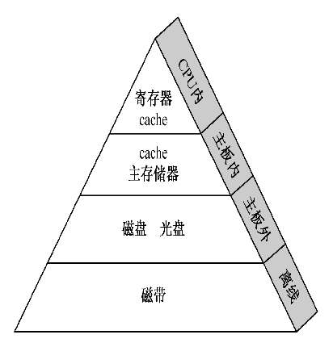
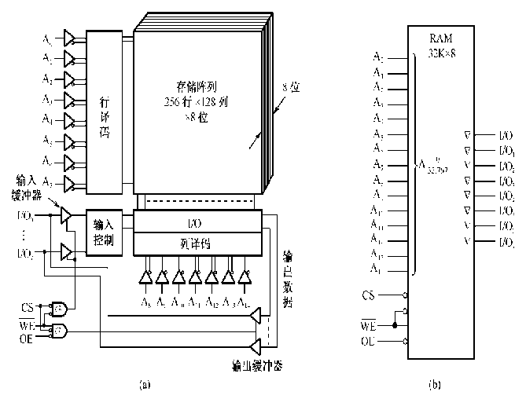
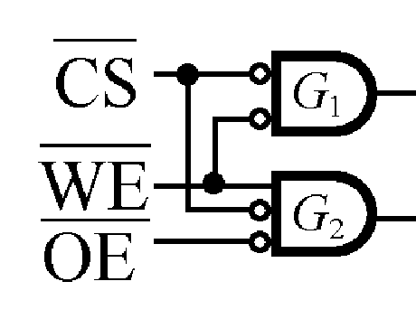
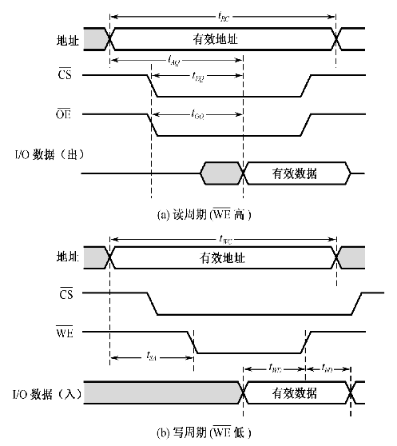
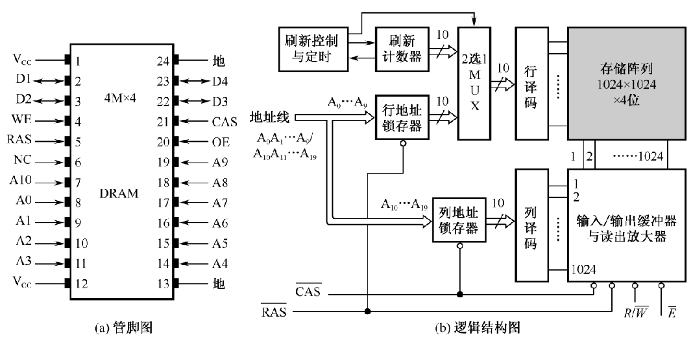
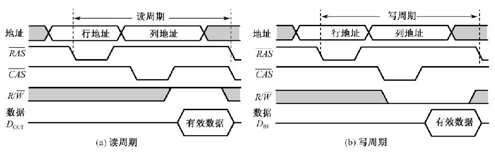

# 存储系统

---

## 存储系统的层次结构

### 程序局部性原理

> 在某一时间内频繁地访问某一局部的存储器地址空间，而对此范围以外的地址空间则很少访问的现象

程序的局部性原理可以体现在：

1. 时间局部性：最近被访问的信息还要被访问，主要体现在顺序结构中。
2. 空间局部性：醉经被访问的信息邻近地址的信息也可能被访问，主要体现在顺序结构中。

### 多级存储结构的组成

**三级存储系统**

| 名称                  | 位于          | 作用                                        | 特点                   |
| --------------------- | ------------- | ------------------------------------------- | ---------------------- |
| 寄存器                | CPU           | 存储正在执行的指令或参与运算的数据          | 访问速度非常快，数量少 |
| cache(高速缓冲存储器) | 内存与CPU之间 | 提升访问速度，使存取速度与CPU运算速度相匹配 | 速度更快，容量小       |
| 主存储器              | 主板内        | 存储正在执行程序的指令和数据                | 速度快，容量小价格高   |
| 外存（辅存）          | 主板外        | 扩大存储容量                                | 速度低，容量大，价格低 |

---

##  存储器

### 分类

**按存储介质分类：**磁表面/半导体存储器

**按存取方式分类：**

* 随机存取存储器：存储器中任何存储单元的内容都可以被随机存取，而存取时间与存取单元的物理位置无关。
* 顺序存取存储器：存储器只能按照某种顺序来存取，即存取时间与存取单元的物理位置有关。

**按读写功能分类：**

* ROM（只读存储器）
* RAM（随机存取存储器）

主存通常被分为RAM和ROM两类。RAM用来存储当前运行的程序和数据，ROM用来存储不变和基本不变的程序和数据。其中RAM还可以根据信息存储方法分类成==静态RAM（SRAM）==和==动态RAM（DRAM）==。SRAM是用半导体管来记忆的，只要不掉电，就不会丢失信息，而DRAM是用电荷来存储信息的，随着时间推移，电荷会漏掉，信息会丢失，所以需要周期性地“刷新。”

### 计数指标

**存储容量：**指一个存储器中可以容纳的存储单元总数。存储容量越大，能存储的信息就越多。
**存取时间：**指一次读操作命令发出到该操作完成，将数据读出到数据总线上所经历的时间。通常取写操作时间等于读操作时间，故称为存储器存取时间。
**存储周期：**指连续启动两次读操作所需间隔的最小时间。通常，存储周期略大于存取时间，其时间单位为ns。
**存储器带宽：**单位时间里存储器所存取的信息量，通常以位/秒或字节/秒做度量单位。若系统总线宽度为W位，则带宽=W/存取周期（bit/s）

### 编址与端模式

**编制：**

**字存储单元：**存放一个机器字的存储单元，相应的单元地址叫==字地址==。
**字节存储单元：**存放一个字节的单元，相应的地址称为==字节地址==。

**端模式：**

* 大端模式：将一个字的==高==有效字节放在内存的==低==地址端，==低==有效字节放在内存的==高==地址端
* 小端模式：将一个字的==低==有效字节放在内存的==低==地址端，==高==有效字节放在内存的==高==地址端

---

## 静态存储器

### SRAM基本逻辑结构

如图为存储容量为32Kx8双译码结构的SRAM逻辑结构图。

**存储体：**
通常把各个字的同一个字的同一位集成在一个芯片（32K×1）中，32K位排成256×128的矩阵。8个片子就可以构成32KB。
**地址译码器：**
采用双译码的方式（减少选择线的数目）地址线一共15条A~0~-A~7~为行地址译码线，A~8~-A~14~为列地址译码线

**读与写的互锁逻辑：**
控制信号中$\overline{\text{CS}}$是片选信号，$\overline{\text{CS}}$有效时（低电平），门G1、G2均被打开。$\overline{\text{OE}}$为读出使能信号，$\overline{\text{OE}}$有效时（低电平），门G2开启，当写命令$\overline{\text{WE}}$=1时（高电平），门G1关闭，存储器进行读操作。写操作时，$\overline{\text{WE}}$=0，门G1开启，门G2关闭。注意，门G1和G2是互锁的，一个开启时另一个必定关闭，这样保证了读时不写，写时不读。

### SRAM的读写时序

图为SRAM的工作的时间关系。

**读周期：**

地址线有效，先进行地址译码；然后片选信号$\overline{\text{CS}}$和读使能信号$\overline{\text{OE}}$有效进行数据的读出；从地址有效开始经过t~AQ~(读出有效时间)数据总线上出现了有效的数据，两个信号恢复高电平；t~RC~时间后才允许数据总线发生变化，t~RC~为==读周期时间==。

**写周期：**

地址线线有效，先进行地址译码；然后片选信号$\overline{\text{CS}}$和读使能信号$\overline{\text{WE}}$有效进行数据的写出；此时数据总线上必置写入数据，在t~WD~时间段内将数据写入存储器；为了写入可靠，数据总线必须有维持时间t~hD~;之后两个信号撤销恢复高电平，但是$\overline{\text{CS}}$维持时间比读周期时间长;t~WC~称为==写周期时间==。

一般，t~RC~=t~WC~,称为存取周期。

---

## 动态存储器

### DRAM的逻辑结构

图为１Mｘ４位DRAM的逻辑结构图。

SRAM不同的是：
（1）增加了行地址锁存器和列地址锁存器。由于DRAM存储器容量很大，地址线宽度相应要增加，这势必增加芯片地址线的管脚数目。为避免这种情况，采取的办法是分时传送地址码。若地址总线宽度为10位，先传送地址码A0～A9，由行选通信号$\overline{\text{RAS}}$打入到行地址锁存器；然后传送地址码A10～A19，由列选通信号$\overline{\text{CAS}}$打入到列地址锁存器。芯片内部两部分合起来，地址线宽度达20位，存储容量为1M×4位。
（2）增加了刷新计数器和相应的控制电路。DRAM读出后必须刷新，而未读写的存储元也要定期刷新，而且要按行刷新，所以刷新计数器的长度等于行地址锁存器。刷新操作与读/写操作是交替进行的，所以通过2选1多路开关来提供刷新行地址或正常读/写的行地址。

### DRAM的读写时序

**读周期：**

地址线上的行地址有效后，用行选通信号$\overline{\text{RAS}}$打入地址锁存器；接着地址线上传输列选通地址，用行选通信号$\overline{\text{CAS}}$打入地址锁存器；经过行列译码后，读写命令R/$\overline{\text{W}}$=1(等于1表示读)，数据线上才会输出数据。

**写周期：**

与读周期相同，经过行列译码后，读写命令R/$\overline{\text{W}}$=0(等于0表示写)，在此期间，数据线上必须送入写入的数据。

每个读周期或者写周期都是从行选通信号$\overline{\text{RAS}}$下降沿开始的，到下一个下降沿结束，也就是连续两个读/写周期的时间间隔。通常情况下读周期=写周期。

### DRAM的刷新操作

**刷新周期：**DRAM存储位元是基于电容器上的电荷量存储，这个电荷量随着时间和温度而减少，因此必须定期地刷新，以保持它们原来记忆的正确信息。

**集中式刷新:**DRAM的所有行在每一个刷新周期中都被刷新。但在刷新时无法进行数据的读写，此时称为**死时间**。

**分散式刷新：**每一行的刷新插入到正常的读/写周期之中，每个读/写周期较于集中式刷新刷新次数变多，增加了行存取时间。

---

## 存储扩展

### 字扩展

给定的芯片存储容量较小（字数少），不满足设计要求的总存储容量，此时需要用多片给定芯片来扩展字数，进行分时工作。三组信号组中给定芯片的地址总线和数据总线公用，控制总线中R/W公用，使能端EN不能公用，它由地址总线的高位段译码来决定片选信号。所需芯片数仍由（d=设计要求的存储器容量/选择芯片存储器容量）决定。

>Q:利用1M×8位的DRAM芯片设计2M×8位的DRAM存储器
>
>A:所需芯片数d=（2M×8）/（1M×8）=2(片)
>字长位数不变，地址总线A~0~—A~19~同时连接到2片DRAM的地址输入端，地址总线最高位有
>A~20~作为两片DRAM的片选信号，可以产生两种片选信号（0和1），两个芯片不会同时工作。

### 位扩展

给定的芯片字数（地址线）符合要求，但位数短，不满足设计要求的存储器字长，此时需要用多片给定芯片进行位扩展。三组信号线中，==地址线和控制线公用而数据线单独分开连接。==

> Q: 利用1M×4位的SRAM芯片，设计一个存储容量为1M×8位的SRAM存储器。
>
> A:所需芯片数量=(1M×8)/(1M×4)=2片

### 字位扩展

当给定的芯片的字数和位数都不符合要求，则需要先进行位扩展，在进行字扩展。
